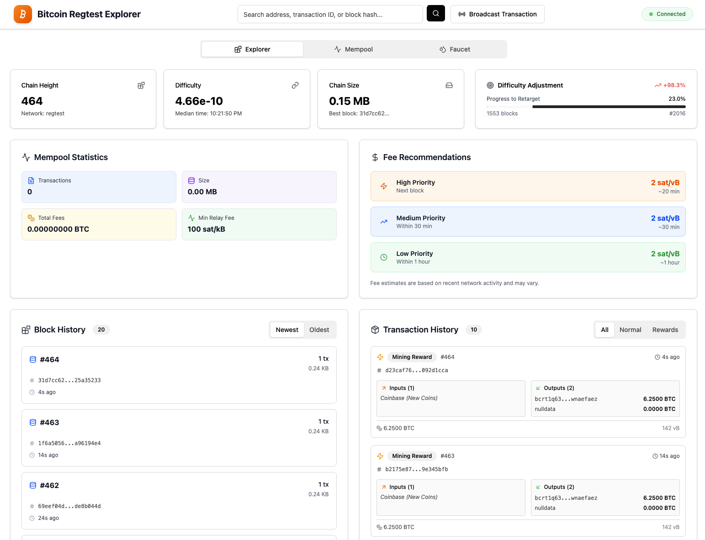

# Bitcoin Regtest Explorer

[](https://opensource.org/licenses/MIT)
[](https://bitcoin.org)
[](https://nodejs.org)
[](https://www.typescriptlang.org)
[](https://www.npmjs.com/package/@bitcoin-regtest/server)
[](https://hub.docker.com/r/fspessina/bitcoin-regtest)

Bitcoin Regtest Explorer is a self-contained Bitcoin Core regtest stack with a modern explorer UI and a programmatic control surface. It is designed for teams that need deterministic, scriptable Bitcoin environments without hand-managing `bitcoind`.

## Why Teams Use It

- Bitcoin Core 30 (regtest), the RPC proxy, auto-miner, and explorer ship in a single container.
- A typed Node.js API (`BitcoinRegtestManager`) starts/stops Core, mines blocks, funds wallets, and exposes the raw RPC client for integration suites.
- The React explorer mirrors mainnet tooling: mempool visibility, fee heuristics, block drill-down, UTXO inspection, and faucet utilities.
- Configuration stays in environment variables, so you can adjust RPC credentials, ports, and mining cadence per pipeline run.

## Screenshots (Reference)

### Block & Transaction History



### Transaction Detail


## Getting Started

### Prerequisites

- **Docker workflow**: Docker Engine/Desktop and Docker Compose.
- **Local workflow** (when running outside Docker): Node.js ≥ 22, Yarn ≥ 1.22, Bitcoin Core ≥ 30 on the PATH.

### Run with Docker (recommended)

```bash
git clone https://github.com/Pessina/bitcoin-regtest.git
cd bitcoin-regtest
yarn docker:dev
```

The explorer becomes available at http://localhost:5173 and the RPC endpoint is exposed on port `18443`.

#### Runtime Configuration

The server merges defaults with environment variables. Override values inline when you start the container:

```bash
AUTO_MINE_INTERVAL_MS=5000 \
AUTO_MINE_INITIAL_BLOCKS=150 \
BITCOIN_RPC_HOST=0.0.0.0 \
BITCOIN_RPC_USER=alice \
BITCOIN_RPC_PASSWORD=supersecret \
yarn docker:dev
```

Supported variables:

| Variable                   | Default     | Purpose                                                                   |
| -------------------------- | ----------- | ------------------------------------------------------------------------- |
| `BITCOIN_RPC_HOST`         | `localhost` | Hostname/IP that the proxy uses to reach `bitcoind` (no protocol prefix). |
| `BITCOIN_RPC_PORT`         | `18443`     | RPC port advertised internally and to the explorer proxy.                 |
| `BITCOIN_RPC_USER`         | `test`      | RPC basic-auth username.                                                  |
| `BITCOIN_RPC_PASSWORD`     | `test123`   | RPC basic-auth password.                                                  |
| `AUTO_MINE_INITIAL_BLOCKS` | `101`       | Blocks mined after wallet creation to unlock coinbase funds.              |
| `AUTO_MINE_INTERVAL_MS`    | `10000`     | Auto-mining cadence for the background block generator.                   |

The same overrides apply to `docker compose up` or `docker run -e KEY=value ...`.

### Run Locally (without Docker)

```bash
git clone https://github.com/Pessina/bitcoin-regtest.git
cd bitcoin-regtest
yarn install
yarn build
yarn start
```

Endpoints (defaults unless overridden):

- Explorer UI: http://localhost:5173
- Bitcoin RPC: `localhost:18443`
- RPC credentials: `test` / `test123`

Adjust configuration via environment variables before running `yarn start` to keep parity with Docker.

## Project Layout

```
bitcoin-regtest/
├── packages/
│   ├── server/                      # Bitcoin regtest manager
│   │   ├── src/
│   │   │   ├── BitcoinRegtestManager.ts
│   │   │   ├── server.ts           # HTTP server & RPC proxy
│   │   │   ├── cli.ts
│   │   │   └── types.ts
│   │   └── package.json
│   └── web/                         # React explorer UI
│       ├── src/
│       │   ├── components/         # React components
│       │   ├── lib/
│       │   │   ├── api.ts          # Bitcoin RPC client
│       │   │   └── timeUtils.ts
│       │   └── App.tsx
│       └── package.json
├── docker-compose.yml
├── Dockerfile
└── package.json
```

## API Usage

```typescript
import { BitcoinRegtestManager } from '@bitcoin-regtest/server';

const manager = new BitcoinRegtestManager({
  autoMineIntervalMs: 5000, // optional overrides
});
```

`BitcoinRegtestManager` responsibilities:

- Start/stop `bitcoind` and wait for readiness.
- Create/load the dedicated regtest wallet and return a default address.
- Mine initial spendable funds and continue mining on a timer.
- Provide helper methods for block mining, funding, and direct RPC access.

Common calls:

```typescript
await manager.start();
const address = manager.getWalletAddress();
await manager.mineBlocks(5);
const txid = await manager.fundAddress('bcrt1qexample...', 1.5);
const client = manager.getClient(); // full bitcoin-core RPC client
await manager.shutdown();
```

See [bitcoin-core documentation](https://github.com/ruimarinho/bitcoin-core) for the full RPC surface area.

## Integration Testing Pattern

```typescript
import { BitcoinRegtestManager } from '@bitcoin-regtest/server';
import { describe, beforeAll, afterAll, it, expect } from '@jest/globals';

describe('Bitcoin Integration Tests', () => {
  let manager: BitcoinRegtestManager;

  beforeAll(async () => {
    manager = new BitcoinRegtestManager({
      autoMineIntervalMs: 5000,
    });
    await manager.start();
  });

  afterAll(async () => {
    await manager.shutdown();
  });

  it('should fund address and confirm transaction', async () => {
    const address = 'bcrt1q...';
    const txid = await manager.fundAddress(address, 1.5);

    const client = manager.getClient();
    const tx = await client.getTransaction(txid);

    expect(tx.confirmations).toBeGreaterThan(0);
  });

  it('should mine blocks on demand', async () => {
    const client = manager.getClient();
    const initialHeight = await client.getBlockCount();

    await manager.mineBlocks(5);

    const newHeight = await client.getBlockCount();
    expect(newHeight).toBe(initialHeight + 5);
  });
});
```

## Architecture Overview

Single-container deployment composed of:

1. **Bitcoin Core v30 (regtest)** — runs with RPC enabled, wallet support, and `txindex`.
2. **Server package** — boots `BitcoinRegtestManager`, proxies `/rpc` requests, and serves the explorer or launches Vite during development.
3. **Explorer UI** — React + Vite frontend that consumes the RPC proxy for blockchain data, mempool statistics, fee insights, faucets, and broadcasting.

Control flow:

1. Container (or local process) launches `packages/server/dist/cli.js`.
2. `BitcoinRegtestManager` starts `bitcoind`, prepares the wallet, and kicks off auto-mining.
3. The server exposes `/rpc`, either serving static assets (production) or proxying to Vite (dev).
4. The explorer uses `/rpc` for all Bitcoin data interactions.

## Development Workflow

Use Yarn scripts from the repository root:

| Command                                  | Description                                                      |
| ---------------------------------------- | ---------------------------------------------------------------- |
| `yarn build`                             | Compile both packages.                                           |
| `yarn build:watch`                       | Rebuild the server package on source changes.                    |
| `yarn start`                             | Start the orchestrator (spawns the explorer or Vite dev server). |
| `yarn type-check`                        | Run TypeScript checks for both packages.                         |
| `yarn lint` / `yarn lint:fix`            | Lint (and optionally fix) all sources.                           |
| `yarn docker:dev`                        | Build the image and launch the container.                        |
| `yarn docker:down` / `yarn docker:clean` | Stop the container or remove volumes.                            |

Package-specific scripts exist under each workspace; for example, `yarn workspace @bitcoin-regtest/web dev` runs the Vite dev server, while `yarn workspace @bitcoin-regtest/server start` launches the server with tsx.

Recommended edit/test loop:

1. `yarn workspace @bitcoin-regtest/server build:watch`
2. `yarn start`
3. Optional: `yarn workspace @bitcoin-regtest/web dev` if you want hot module replacement.

## Troubleshooting

| Scenario                       | Resolution                                                                                                                                                       |
| ------------------------------ | ---------------------------------------------------------------------------------------------------------------------------------------------------------------- |
| Ports 18443/5173 already bound | Stop the conflicting process, e.g. `bitcoin-cli -regtest stop`, `pkill bitcoind`, or `yarn docker:down`.                                                         |
| Reset regtest chainstate       | Remove the regtest directory (`~/Library/Application Support/Bitcoin/regtest`, `~/.bitcoin/regtest`, or `%APPDATA%\Bitcoin\regtest`) or run `yarn docker:clean`. |
| Broken installs/builds         | `yarn clean && rm -rf node_modules packages/*/node_modules && yarn install && yarn build`.                                                                       |

Enable `DEBUG=bitcoin-regtest:*` (or similar custom logger) in the future if deeper instrumentation is added; for now, logs stream directly from the orchestrator and Vite/React consoles.

## Publishing

`@bitcoin-regtest/server` is publishable to npm. The workflow is automated via `prepublishOnly`.

1. Bump the version (`yarn version:patch|minor|major`).
2. Run `yarn publish:server`. The `prepublishOnly` hook handles format/lint/type-check/build beforehand.
3. Verify the published tarball includes `dist`, type declarations, and metadata.

For manual control:

```bash
cd packages/server
npm publish --access public
```

Keep the usual release hygiene: update any changelog, ensure CI/test suites pass, and confirm you are logged in with publish rights.

### Docker Images

Local validation:

```bash
# Build locally
docker build -t pessina/bitcoin-regtest:dev .
```

Tag suggestions for published images:

- `latest` for the most recent stable build.
- `vX.Y.Z` mirroring the npm version.
- `ci-<build>` for ephemeral previews.

Ensure the Docker Hub description references this repository and highlights the explorer capabilities.

#### GitHub Actions Publishing

A GitHub Actions workflow (`.github/workflows/docker-publish.yml`) supports manual publishing from the repo:

1. Store Docker Hub credentials in repository secrets:
   - `DOCKERHUB_USERNAME`
   - `DOCKERHUB_TOKEN` (create a [Docker access token](https://hub.docker.com/settings/security)).
2. Any push to `main` automatically builds and pushes `fspessina/bitcoin-regtest` with tags `latest` and the commit SHA (if credentials are configured).
3. To publish from another branch or override tags, trigger **Publish Docker Image** manually from the Actions tab and provide optional inputs (`image`, `tag`, `npm_version`).

The workflow builds with Buildx (multi-platform ready) and pushes only when credentials are present; otherwise it performs a dry run.

## Contributing

Contributions are welcome—follow the guidance in [CONTRIBUTING.md](CONTRIBUTING.md) and prefer Conventional Commit messages. Pull requests should include formatting, lint, type, and build checks.

## License

MIT License – see [LICENSE](LICENSE) for details.

## Useful Links

- [Issue Tracker](https://github.com/Pessina/bitcoin-regtest/issues)
- [Bitcoin Core Docs](https://bitcoin.org/en/bitcoin-core/)
- [bitcoin-core Node.js Client](https://github.com/ruimarinho/bitcoin-core)
